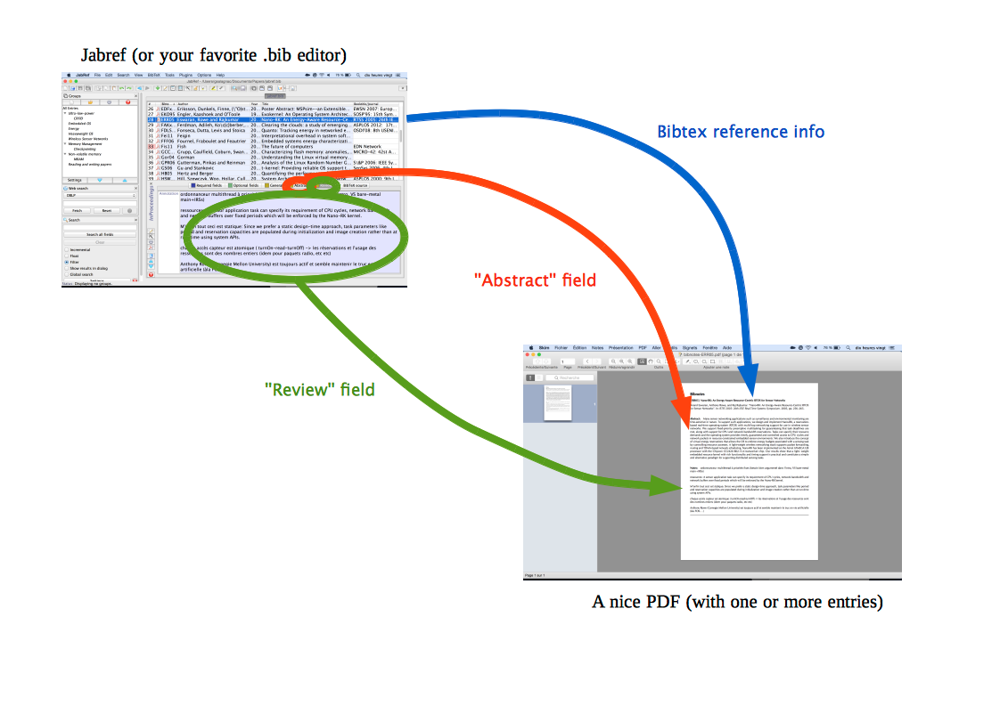

extract-bibnotes
================

This script reads your `.bib` database and extracts a printable
one-page summary for each paper, with the complete reference, the
abstract, and markdown-formatted notes. 

# Big picture

  

# Getting started

to get started, try the following commands:

1. `make clean`
2. `make pick KEYS='FSTx42' `
3. open the .pdf file (`bibnotes-FSTx42.pdf`) and look how pretty it is
4. `make pick KEYS=RFL15' `
5. `make pick KEYS='RFL15 FSTx42' `
6. `make view`
7. `make all`

If all dependencies are installed correctly, you should get a decent
idea of how it works. it not, drop me an e-mail.

# Dependencies

TODO: this is incomplete. any problem report appreciated.

dependencies:
- latex
- biblatex
- python2
- pandoc

## specific jabref settings

"Do not wrap the following fields when saving:" must contain "annotation"

(we want markdown formatting, thus whitespace is meaningful)
